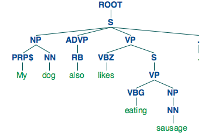

NLTK

<pre>import nltk</pre>

1. Penn Tree

	Sentence:	<i>My dog also likes eating sausage.</i>
	
	<pre>
	<b>tree_str</b> = '''(ROOT
	  (S
	    (NP (PRP$ My) (NN dog))
	    (ADVP (RB also))
	    (VP (VBZ likes)
	      (S
	        (VP (VBG eating)
	          (NP (NN sausage)))))
	    (. .)))'''	</pre>
	
	
	<pre><b>t</b> = nltk.Tree(tree_str)</pre>

	`t` is a <code>\<nltk.tree.Tree\></code> object
	
		t.append                        t.draw                          t.insert                        t.pos                           t.sort
		t.chomsky_normal_form           t.extend                        t.leaf_treeposition             t.pprint                        t.subtrees
		t.collapse_unary                t.flatten                       t.leaves                        t.pprint_latex_qtree            t.treeposition_spanning_leaves
		t.convert                       t.freeze                        t.node                          t.productions                   t.treepositions
		t.copy                          t.height                        t.parse                         t.remove                        t.un_chomsky_normal_form
		t.count                         t.index                         t.pop                           t.reverse
	
	
	<pre>t.draw</pre>
	
	
	
	

