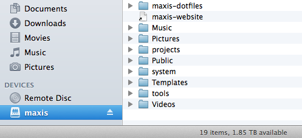

SSHFS
---


###Requirement: `sshfs`

Download packages [Here](http://osxfuse.github.io/). (for Mac)


###Mount a remote folder


mkdir `<local-mount-point>`

sshfs `<hostname>`:`<remote-path>` `<local-mount-point>`


e.g.,

```
mkdir doraemon-corpus
sshfs -P 2222 <your-username>@doraemon.iis.sinica.edu.tw:/corpus doraemon-corpus
```

Now we can use GUI or IDE to write codes and execute the program just like local files ☺︎




---


Samba
---

If SSHFS doesn't work, or you are currently working on Windows, try this way to mount remote folders.

- Mac

  1. open Finder
  2. press `command + k`
  3. input `smb://doraemon.iis.sinica.edu.tw`
  4. enter authentication information
  5. select the folder you're going to mount, e.g., corpus
  6. access files or folders from mounted disk "corpus" directly!
  
- Windows

  1. Right click on `My Computer`
  2. Choose `Map Network drive`
  3. Select a available Drive label
  4. Folder: `\\doraemon.iis.sinica.edu.tw\corpus`
  

Note: For now I just have the `/corpus` shared on doraemon, let me know if you need any other directories to work on.
