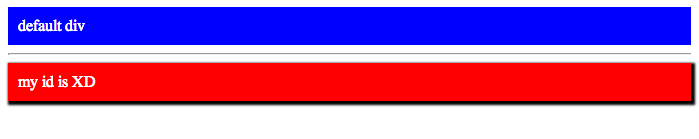

##Compass
 

###Get compass

1. [Install](http://compass-style.org/install/)

2. [About Sass](http://sass-lang.com/)

###projects

1. 建立 compass project
	
	<pre>compass create <b>glance</b> </pre>
	
	
2. 在 glance/sass 寫 code, <code>.scss </code> or <code>.sass </code>

	<pre>glance/sass/test.sass

3. compass 會 compile 成 <code>.css</code>，放在 glance/stylesheets

	<pre>glance/stylesheets/test.css
	

###Hello word

* 監控任何 sass, scss 的改變 (建議用 <code>tmux</code> 切一個 window or panel)

	<pre> compass watch <b>glance</b> </pre>

* sample 

	<code>glance/sass/test.sass</code>

		@import "compass/css3" 					// import default mixin from compass
		$defaultFontSize:14 					// 設定變數
		@mixin sexy-border ($size, $color)		// 巨集
				border: $size solid $color
		body									// 支援 tag 巢狀
			div
				background: blue
				color: white
				padding: 10px
		
		#XD
			background: red
			font-size: $defaultFontSize			// 變數這樣用
			+box-shadow(black 2px 2px 2px 2px)  // compass 內建的 browsers compatible mixin
			+sexy-border(5, yellow)				// 我們自己的 minin

* in HTML

	<code>/index.html</code>
	
	1. in \<head\>

			<link type="text/css" rel="stylesheet" href="glance/stylesheets/test.css" />
	
	2. in \<body\>
	
			

				default div
			

		
			

		
			

				my id is XD
			

* Demo

	
