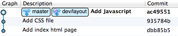

Git-rebase
===

1. `(master)` Switched to a new branch 'dev/layout'

		git co -b dev/layouts
	
	
	
	
2. `(dev/layout)` made some changes

	

3. `(dev/layout)` need to a js library in `master`

		git co master
		
	

4. `(dev/layout)` Switched back to to 'dev/layout'

	

5. `(dev/layout)` keep modifying files

	

6. `(dev/layout)` All modification done.	Rebase `dev/layout` to master

		git rebase master -i

	
	
7. `(dev/layout)` switch back to master 
	
	
	
	
8. `(master)` and merge `(dev/layout)`

	if we use the following command, would yield a __Fast-Forward__ situation!

		git merge master

	

	We don't want this because of the idea of keeping change logs in `dev/layout` branch
	 
	So what we are gonna do is give the option `--no-ff` to prevent from fast-forwarding.
	
		git merge master --no-ff 

	
