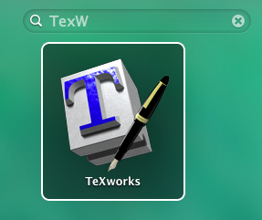
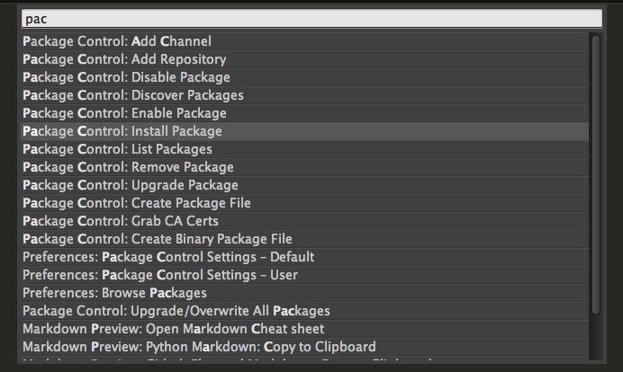
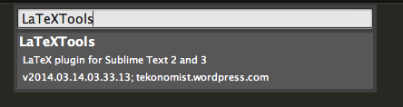

#LaTeX

A quick and simple guide for using LaTex on Mac.


##Requirements

1. [MacTex](http://tug.org/mactex/downloading.html)
2. [Sublime Text](http://www.sublimetext.com/3) (optional)
3. templates: [acl2014.tex](docs/acl2014.tex), [acl2014.sty](docs/acl2014.sty)

##Getting Started


###1. using Texworks

* go to the dashboard and type in Texwork

	
	
* open `acl2014.tex` and press the left-top button (run), and you will see the pdf preview on the right side.
	

###2. using Sublime Text

* ##### open __Sublime Text__

* ##### install [LaTexTools](https://github.com/SublimeText/LaTeXTools) through Package Control

	1. use `cmd + shift + p` to evoke the **command palette**
	
		search __Package Control__ by typing in "pac" and choose `Install Package`

		
		
	2. input _LatTextools_, and get this tool installed.
	
		


* ##### Compilation

	1. open `acl2014.tex`, press `cmd + b` to compile
	
		If you see this prompts, open the **command palette** again
		
		and type in `LaTeXTools: Reconfigure and migrate settings` and hit Return. ([issue](http://tex.stackexchange.com/questions/165339/latextools-you-need-to-migrate-your-preferences-see-the-readme-file-for-instru))
	
		```
LaTeXTools: you need to migrate your preferences. See the README file for instructions.
		```
		
	2. after compilation, you will see a file named `acl2014.pdf`


