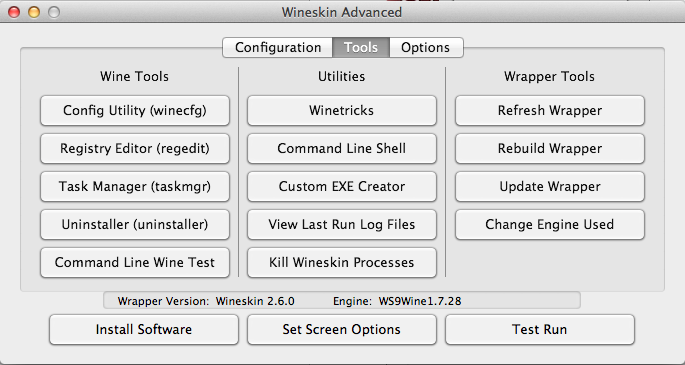

Wineskin
========

## 1. 打開 winskin
	
- 裝 Engine & Update Wrapper

	

## 2. 安裝

- 選擇安裝程式 (or 直接選擇目錄複製)

	

- 找到 exe
	
	

- 跳出 windows 安裝視窗

	
	
- 等跑完

	


## 3. 選擇執行檔


## 4. 設定

- 主畫面

	

- Advanced > Configuration

	
	
	- `Windows EXE`: 開始遊戲的執行檔
	- `EXE Flags`: 執行遊戲的參數
		- ex: __Dungeon Keeper 2__ 需要  
		
			```
			-SOFTWAREFILTER : Enables Software Filter (Bilinear Filtering)
			-32BITEVERYTHING : Enables 32Bit Textures, ZBuffer and 
			```
	- `Icon`: 顯示在 Application 的圖示, 要用 `.icns` (可在[這裡](http://iconverticons.com/online/)轉檔)
	
- Advanced > Tools

	
	
	這邊可以設定機碼 (regedit) 有的沒的，基本上不用管他
	
- Advanced > Optopns

	
	
	如果遊戲跑不起來，這邊有 `CPU`、`按鍵` 設定
	
- Set Screen Option (**重要!!**)
	
	
	
	最重要的一個，先在右邊選擇 `Override`，才能改左邊 `全螢幕 (Fullscreen)`、`視窗 (windowed)` 設定
	
	右下角有 Direct3D 設定，對舊遊戲影響很大！
	
- Test Run
	
	
	
	跑跑看有沒有問題
	
### 5. Location

`/Users/<username>/Applications/Wineskin`


	